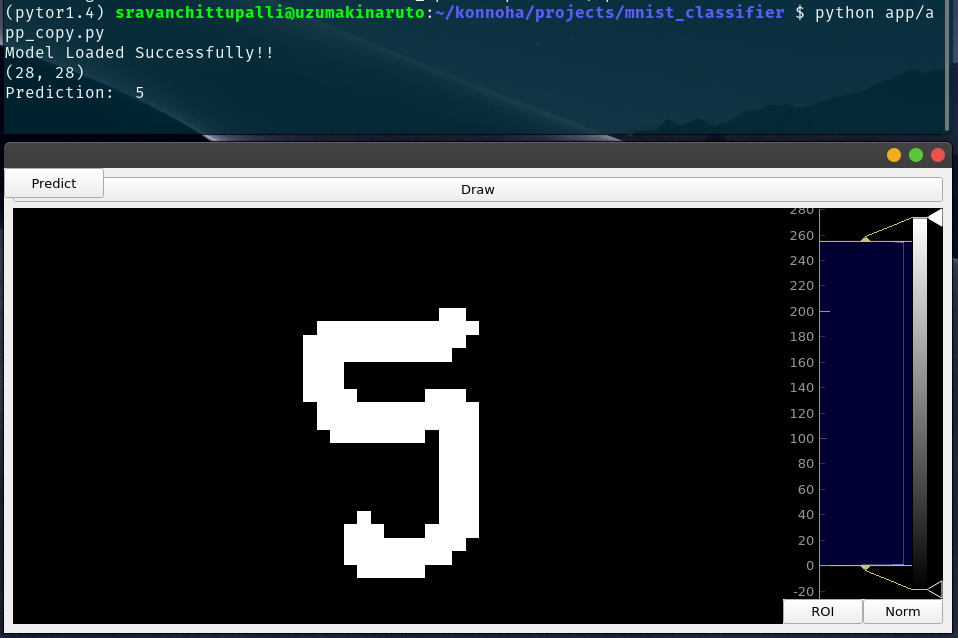
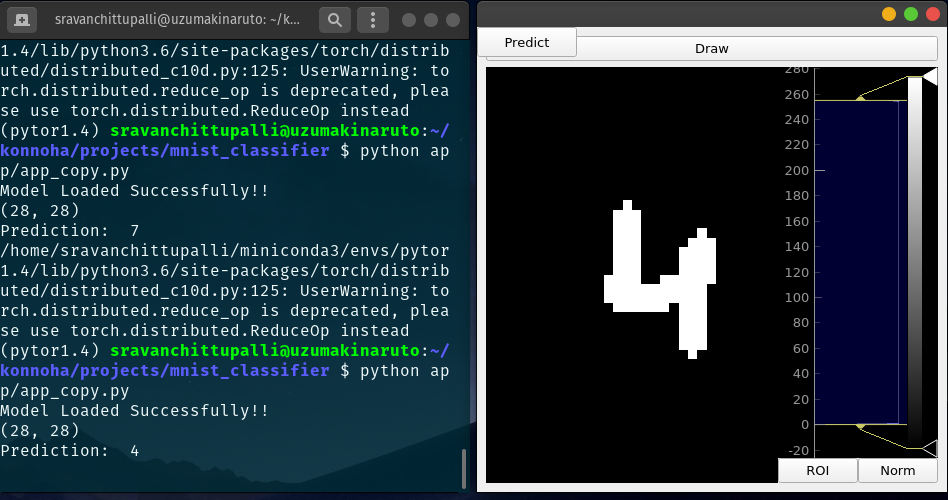

# DigitClassifier-App-using-PyTorch ⑦


<!-- TABLE OF CONTENTS -->
## Table of Contents

* [About the Project](#about-the-project)
  * [Built With](#built-with)
* [Getting Started](#getting-started)
  * [Prerequisites](#prerequisites)
* [Usage](#usage)
* [Output](#output)
* [Roadmap](#roadmap)
* [Contributing](#contributing)
* [License](#license)
* [Contact](#contact)
* [Acknowledgements](#acknowledgements)

```
├── app                                                                                 // For future implementation in 
│   ├── Models
│   │    ├── __init__.py
│   │    ├── FeedForward.py
│   │    ├── Perceptron.py
│   │    └── CNN.py
│   ├── train
│   │   ├── train_CNN.ipynb 
│   │   └── train_feedforward.ipynb
│   ├── savedModels
│   │   ├── MNIST_CNN.pth
│   │   ├── MNIST_FeedForward.pth
│   │   └── MNIST_Perceptron.pth
│   ├── utils
│   │   ├── __init__.py
│   │   └── camera.py 
│   ├── CNNClassifierApp.py
│   └── FeedforwardClassifierApp.py 
├── LICENSE                                                                             // License
├── assets                                                                              // Testing mqtt mosquitto lib
│   ├── out_vid1.mkv
│   ├── out_vid2.mkv
│   ├── output1.png 
│   ├── output2.png 
│   └── wrongop_1MNIST.png
└── README.md                                                                           // This file
```


<!-- ABOUT THE PROJECT -->
## About The Project

In this project I experimented a bit with different neural network architectures and saw how good each of the architectures were performing on MNIST dataset. Along with that I created a basic GUI application to take input from user and display the predicted number.  
Different Architectures:- 
- ### Perceptron
  

I tried with a perceptron first but as you know the results were not very good. The accuracy was low and even with the data from MNIST it was not giving accurate results. 

- ### FeedForward
   

Next I tried a feed forward neural network with one hidden layer. The results were better than before i.e I got an accuracy of 80% within the first few epochs. When I tested it on the MNIST test set I got around 82% accuracy which is pretty good. There is one problem. The FeedForward neural networks do not take the shape into consideration. They just see the pixel intensities at locations and produces an output. Now assume a senario where 3 was written in such a way that it is covering all the activated parts for 8, then the model can be fooled easily.

- ### CNN
  

Then I implemented a CNN architecture and still got a ~83% accuracy within a few epochs. Now when I tried it on custom that I made I got good results. The reason for this is that CNN takes into consideration the shapes i.e it doesnot just take the intensities into consideration, it also extracts features and gives results based on them. The convolutional layers create feature maps that record a region of image which is ultimately broken into rectangles and sent out for nonlinear processing. The only problem with CNN is that they need a lot of data to get trained but here as MNIST dataset has a lot of images we have no issues.

### Built With

* [PyTorch](https://pytorch.org/)
* [PyQT5](https://pypi.org/project/PyQt5/)


<!-- GETTING STARTED -->
## Getting Started

To get a local copy up and running follow these simple steps.

### Prerequisites
I strongly recommend the use of miniconda to create virtual environments

Install the following python modules:-
 - [PyTorch](https://pytorch.org/)
 - [OpenCV](https://pypi.org/project/opencv-python/4.2.0.34/)
 - [PyQT5](https://pypi.org/project/PyQt5/)
 
Thats it :smile:

### Usage

1st activate your environment. Then follow the given steps.

```sh
git clone https://github.com/SravanChittupalli/DigitClassifier-App-using-PyTorch.git
cd DigitClassifier-App-using-PyTorch/app
python CNNClassifierApp.py

```
Now you can find a GUI app on your screen. Play with it and let me know if there are any problems by creating an issue

<!-- OUTPUT -->
## Output
[Video1](https://youtu.be/L_p24OEvZNM) [Video2](https://youtu.be/zi88aBamRfg)

<br />
<p align="center">
  
  <p align="center">
  <br />
  
  </p>
</p>
<br />

<!-- LICENSE -->
## License

Distributed under the MIT License. See `LICENSE` for more information.
